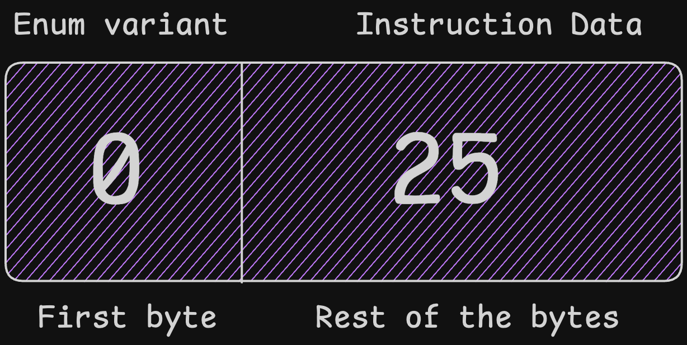

Your program instructions are operations it can do, and they are defined using Rust enums. You can visualize instructions as public API endpoints, which are represented by each variant of the enum.

For example, the counter program will have two instructions: one to initialize the counter with a value and the other to increment the counter.

To represent the requirements above in a Solana program, create an `instructions.rs` and create the enum below:

```rust title="Rust"
use borsh::{BorshDeserialize, BorshSerialize};

#[derive(BorshSerialize, BorshDeserialize, Debug)]
pub enum CounterInstruction {
    InitializeCounter { initial_value: u64 },
    IncrementCounter,
}
```

Notice that the enum above implements Borsh’s serialize and deserialize traits. This is because, similar to program state, instruction data must be sent to the Solana program as raw bytes.

When a client invokes your program, they’ll have to specify which instruction they want to execute, along with the data it requires. This information must be sent as a buffer of bytes.

The first byte in the buffer identifies the index of the instruction to execute on your enum, and the rest of the bytes represent the data it requires, if any.



To convert the bytes in the enum variant and instruction data, it is common to implement a helper function, usually called `unpack`. The helper function:

- Splits the first byte to get the instruction variant,
- Matches the variant and parses any additional parameters from the remaining bytes, and
- Returns the corresponding enum variant.

You can implement it like so:

```rust title="Rust"
use solana_program::program_error::ProgramError;

impl CounterInstruction {
    pub fn unpack(input: &[u8]) -> Result<Self, ProgramError> {
        //split the input into the first byte (variant) and the rest of the data
        let (&variant, rest) = input
            .split_first()
            .ok_or(ProgramError::InvalidInstructionData)?;

        // Match the variant to determine which instruction to create
        match variant {
            // 0 for InitializeCounter
            0 => {
                // Ensure the rest of the data is at least 8 bytes for u64
                if rest.len() < 8 {
                    return Err(ProgramError::InvalidInstructionData);
                }

                // Convert the rest of the data into a u64
                let initial_value = u64::from_le_bytes(
                    rest.try_into()
                        .map_err(|_| ProgramError::InvalidInstructionData)?,
                );

                // Return the InitializeCounter instruction
                Ok(Self::InitializeCounter { initial_value })
            }

            // 1 for IncrementCounter
            1 => Ok(Self::IncrementCounter),

            // If the variant is not recognized, return an error
            _ => return Err(ProgramError::InvalidInstructionData),
        }
    }
}
```

The code block above imports `ProgramError` to gracefully handle and report errors. Solana expects your program to return a `Result<T, ProgramError>` from instruction processing. This lets the runtime know whether your program succeeded `(Ok)` or failed `(Err)`, and why. If you don’t handle and return errors, your program may panic, crash, or behave unexpectedly.

### Bonus: Deserialization with Borsh

Although the enum derives `BorshDeserialize`, the `unpack` function decodes manually to demonstrate how Solana instructions are typically parsed using byte matching. You could alternatively use `CounterInstruction::try_from_slice(input)` with Borsh if you control both client and program.

If you control the client, you can send the data, like so:

```typescript title="TypeScript"
const instructionData = Buffer.from(
  borsh.serialize(CounterInstructionSchema, {
    InitializeCounter: { initial_value: 5 }
  })
);

```

…and decode in your program like so:

```rust title="Rust"
let instruction = CounterInstruction::try_from_slice(input)?;
```

Because you're using Borsh on both ends, the data will serialize and deserialize consistently.

Now that you have implemented the instructions, your program can handle them. Next, you will implement the logic that your program will execute when each instruction is called.