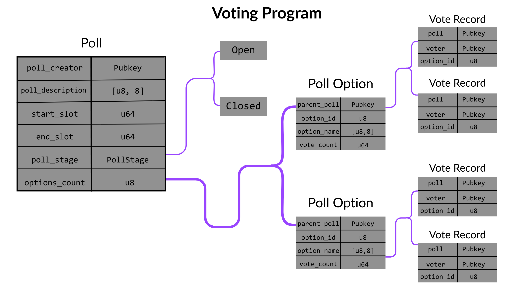

import { Term } from "../../../src/components/link-hover";

You already explored how state is defined in the last program you built (counter program), but that implementation is simplistic compared to what you’re building here.

Following the project requirements, you need the following:

- A way to store information about what people are voting for (description, duration, options, etc).
- A way to store the options associated with the poll.
- A way to store and count the votes for each option associated with the poll.

The requirements can be translated into 3 account structs: `Poll`, `PollOption`, and `VoteRecord`. These three accounts will hold the data for your program.

## The `Poll` account

The `Poll` account stores the core information about the poll, such as its description and voting window. However, there are a few more fields it should hold; for instance, it should keep track of the poll’s creator using their public key for access control checks, because, remember, only the poll’s creator can close the poll. It should also store the state of the poll (Open/Closed) and a count of the options the poll has for input validation, and the start and end <Term term="slot"/> for time tracking (more on this later).

Putting all that into consideration, your `Poll` struct should look like the one below:

```rust title="state/poll.rs"
use crate::enums::poll_stage::PollStage;
use borsh::{BorshDeserialize, BorshSerialize};

pub const MAX_DESC_LEN: usize = 255;

#[derive(BorshSerialize, BorshDeserialize, Debug)]
pub struct Poll {
    pub poll_creator: Pubkey,

// [!code highlight]
    pub desc_len: u8,
    pub poll_description: [u8; MAX_DESC_LEN],

    /// Absolute slots avoid ambiguity once on-chain
    pub start_slot: u64,
    pub end_slot: u64,

// [!code highlight]
    pub poll_stage: PollStage,

    /// Count of registered options
    pub options_count: u8,
}
```

<Callout title="Info">

Create a state/poll.rs file and add the code block above to it.

</Callout>

If you take a look at the code block above, you’ll notice some additional fields that we haven't covered yet. The first one is `desc_len`. To understand what that property does, first, you have to understand why the `poll_description` type is a fixed-length buffer instead of a variable-length string.

Solana accounts must have a fixed size at creation, a variable‑length `String` forces you to either over‑allocate (wasting rent) or perform costly, error‑prone reallocations. A fixed `[u8; MAX] + len` avoids heap allocations during (de)serialization, is rent‑efficient, and gives predictable, bounded reads/writes.

Now, back to `desc_len`, it tells your program how many of the reserved bytes are “real” text. When a creator writes a 120-byte description, you have 135 unused bytes left in the description field. Without a separate length, you would need to: Scan for the first zero byte every time you read, or store a null terminator and hope writers never forget to add it. Both approaches are fragile and waste compute (we will cover some other compute optimization strategies in later sections).

<Callout title="Info">

You can set your MAX_DESC_LEN to any value you deem worthy. However, keep in mind that you have to adjust the `desc_len` type for any values above 255 to avoid an integer overflow.

</Callout>

### The `PollStage` enum

As we discussed earlier, a poll can only exist in two states: `Open` and `Closed`. So, create an `enums/poll_stage.rs` file and add the code block below to it:

```rust title="enums/poll_stage.rs"
use borsh::{BorshDeserialize, BorshSerialize};

#[repr(u8)]
#[derive(BorshSerialize, BorshDeserialize, Debug, Clone, Copy, PartialEq, Eq)]
pub enum PollStage {
    Open,
    Closed,
}
```

<Callout title="Info">
The `#[repr(u8)]` trait guarantees the enum takes exactly 1 byte.

</Callout>

When you serialize the `PollStage` enum into account data, it gets converted to a `u8` value (0 for Open, 1 for Closed ). When reading it back, you need to convert from `u8` back to the enum.

You can implement conversion traits to make this process easier:

```rust title="Rust"
impl From<PollStage> for u8 {
    fn from(stage: PollStage) -> u8 {
        stage as u8
    }
}

/// If someone writes an invalid value (say, a buggy upgrade or a malicious client),
/// the conversion fails cleanly and you return an error instead of continuing with an undefined variant.
impl TryFrom<u8> for PollStage {
    type Error = ();
    fn try_from(value: u8) -> Result<Self, ()> {
        match value {
            0 => Ok(PollStage::Open),
            1 => Ok(PollStage::Closed),
            _ => Err(()),
        }
    }
}
```

## `PollOption` accounts

The `PollOption` account stores information about each poll option, such as an identifier, the parent poll’s public key, the option name, and, of course, the number of votes the option has.

Putting all that into consideration, your `PollOption` struct should look like the one below:

```rust title="state/poll_option.rs"
use borsh::{BorshDeserialize, BorshSerialize};
use solana_program::{program_error::ProgramError, pubkey::Pubkey};

pub const MAX_OPTION_NAME_LEN: usize = 64;

#[derive(BorshSerialize, BorshDeserialize, Debug)]
pub struct PollOption {
    pub parent_poll: Pubkey,
    pub option_id: u8,

    pub name_len: u8,
    pub option_name: [u8; MAX_OPTION_NAME_LEN],

    pub vote_count: u64,
}

```

<Callout title="Info">

Create a `state/poll_option.rs` file and add the code block above to it.

</Callout>

## `VoteRecord` accounts

The `VoteRecord` accounts serve as proof of votes, immutable records that a specific voters cast for a specific option in a specific poll. It tracks the poll the vote belongs to, the user that made the vote, and the user’s choice (option_id).

Putting all that into consideration, your `VoteRecord` struct should look like the one below:

```rust title="state/vote_record.rs"
use borsh::{BorshDeserialize, BorshSerialize};
use solana_program::{program_error::ProgramError, pubkey::Pubkey};

#[derive(BorshSerialize, BorshDeserialize, Debug, Clone)]
pub struct VoteRecord {
    pub poll: Pubkey,
    pub voter: Pubkey,
    pub option_id: u8,
}
```

<Callout title="Info">

Create a `state/vote_record.rs` file and add the code block above to it.

</Callout>

Your program’s account structure now looks like the image below:


## The problem with plain state

The current structure of your account structs leave a subtle security hole. When you serialize these structs with Borsh, the resulting byte array contains only field data; it carries no built-in hint about which struct it represents.

During deserialization your program simply casts the bytes into the type it expects. If a client supplies an account whose layout does not match, either by accident or on purpose, Borsh will still convert the bytes, and your logic will read them as if they were correct.

For example:

```rust title="Rust"
// create a VoteRecord and serialize it
let vote = VoteRecord {
    poll: Pubkey::new_unique(),          // 32 bytes
    voter: Pubkey::new_unique(),         // 32 bytes
    option_id: 5u8,                      // 1 byte
};
let bytes = vote.try_to_vec()?;          // → 65-byte Vec<u8>

// WRONGLY deserialize the same bytes as a Poll
let poll: Poll = Poll::try_from_slice(&bytes)?;   // succeeds!
```

This ambiguity opens two doors for abuse. A malicious client could hand you a `VoteRecord` account when your instruction expects a `Poll`. Because the layouts differ, the values you read for `poll_creator`, `start_slot`, or `options_count` will be nonsense, yet your program will treat them as legitimate and may, for instance, let the attacker close a poll they do not own.

Even more dangerously, an attacker could craft raw bytes that deserialize into a `Poll` whose `poll_creator` field coincidentally equals their own public key. Your access-control check would pass, and the attacker would obtain privileged powers over someone else’s poll. You can patch this vulnerability using **account discriminators**.
